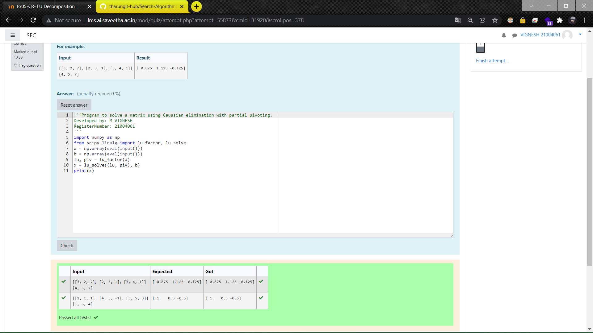

# LU Decomposition without zero on the diagonal

## AIM:
To write a program to find the LU Decomposition of a matrix.

## Equipments Required:
1. Hardware – PCs
2. Anaconda – Python 3.7 Installation / Moodle-Code Runner

## Algorithm
1. Import the numpy module to use the built-in functions for calculation
2. Get the matrix form from user using np.array(eval(input()))
3. Using the lu, piv = lu_factor()
              x = lu_solve((lu, piv), )
              we can find the LU decomposition of matrix
4. End the program

## Program:
```
/*
Program to find the LU Decomposition of a matrix.
Developed by: M VIGNESH
RegisterNumber: 21004061
*/
import numpy as np 
from scipy.linalg import lu_factor, lu_solve
a = np.array(eval(input()))
b = np.array(eval(input()))
lu, piv = lu_factor(a)
x = lu_solve((lu, piv), b)
print(x)
```

## Output:



## Result:
Thus the program to find the LU Decomposition of a matrix is written and verified using python programming.

